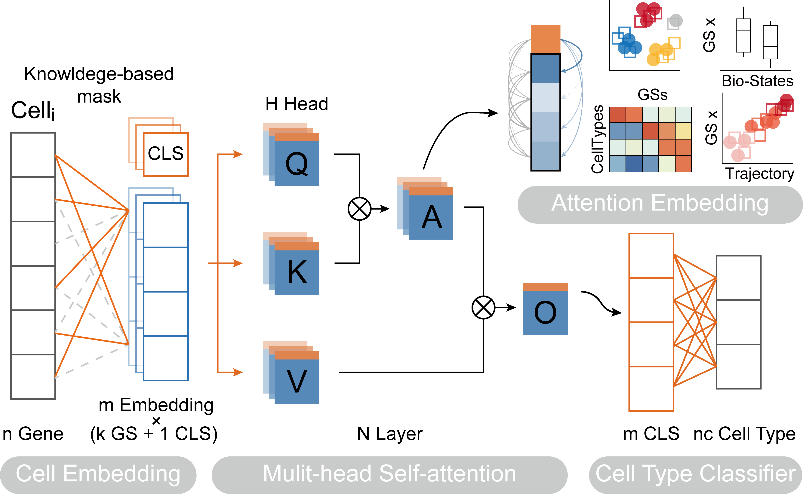

# TOSICA: Transformer for One-Stop Interpretable Cell-type Annotation



## Package: `TOSICA`

We created the python package called `TOSICA` that uses `scanpy` ans `torch` to explainablely annotate cell type on single-cell RNA-seq data.

### Requirements

+ Linux/UNIX/Windows system
+ Python >= 3.8
+ torch >= 1.7.1

### Create environment

```
conda create -n TOSICA python=3.8 scanpy
conda activate TOSICA
conda install pytorch=1.7.1 torchvision=0.8.2 torchaudio=0.7.2 cudatoolkit=10.1 -c pytorch
```

### Installation

The `TOSICA` python package is in the folder TOSICA. You can simply install it from the root of this repository using

```
pip install .
```

Alternatively, you can also install the package directly from GitHub via

```
pip install git+https://github.com/JackieHanLab/TOSICA.git
```

### Environment has been tested

`TOSICA.yaml`

## Usage

### Step 1: Training the model

```py
TOSICA.train(ref_adata, gmt_path,project=<my_project>,label_name=<label_key>)
```

#### Input:

+ `ref_adata`: an `AnnData` object of reference dataset.
+ `gmt_path` : default pre-prepared mask or path to .gmt files.
+ `<my_project>`: the model will be saved in a folder named <my_project>. Default: `<gmt_path>_20xxxxxx`.
+ `<label_key>`: the name of the label column in `ref_adata.obs`.

#### Pre-prepared mask:

+ `human_gobp` : GO_bp.gmt
+ `human_immune` : immune.gmt
+ `human_reactome` : reactome.gmt
+ `human_tf` : TF.gmt
+ `mouse_gobp` : m_GO_bp.gmt
+ `mouse_reactome` : m_reactome.gmt
+ `mouse_tf` : m_TF.gmt

#### Output:

+ `./my_project/mask.npy` : Mask matrix
+ `./my_project/pathway.csv` : Gene set list
+ `./my_project/label_dictionary.csv` : Label list
+ `./my_project/model-n.pth` : Weights

### Step 2: Prediect by the model

```py
new_adata = TOSICA.pre(query_adata, model_weight_path = <path to optional weight>,project=<my_project>)
```

#### Input:

+ `query_adata`: an `AnnData` object of query dataset .
+ `model_weight_path`: the weights generated during `scTrans.train`, like: `'./weights20220607/model-6.pth'`.
+ `project`: name of the folder build in training step, like: `my_project` or `<gmt_path>_20xxxxxx`.

#### Output:

+ `new_adata.X` : Attention matrix
+ `new_adata.obs['Prediction']` : Predicted labels
+ `new_adata.obs['Probability']` : Probability of the prediction
+ `new_adata.var['pathway_index']` : Gene set of each colume
+ `./my_project/gene2token_weights.csv` : The weights matrix of genes to tokens

> **Warning:** the `var_names` (genes) of the `ref_adata` and `query_adata` must be consistent and in the same order.
> ```
> query_adata = query_adata[:,ref_adata.var_names]
> ```
> Please run the code to make sure they are the same.  


### Example Demo:

[Guided Tutorial](test/tutorial.ipynb)

### Cite TOSICA:

[Chen, J., Xu, H., Tao, W. et al. Transformer for one stop interpretable cell type annotation. Nat Commun 14, 223 (2023).](https://doi.org/10.1038/s41467-023-35923-4)
